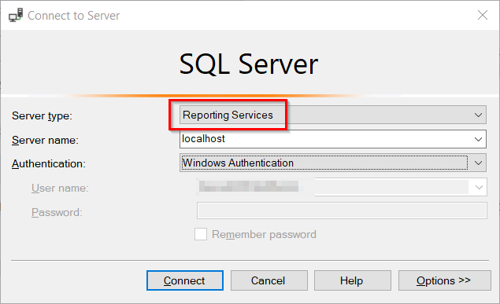
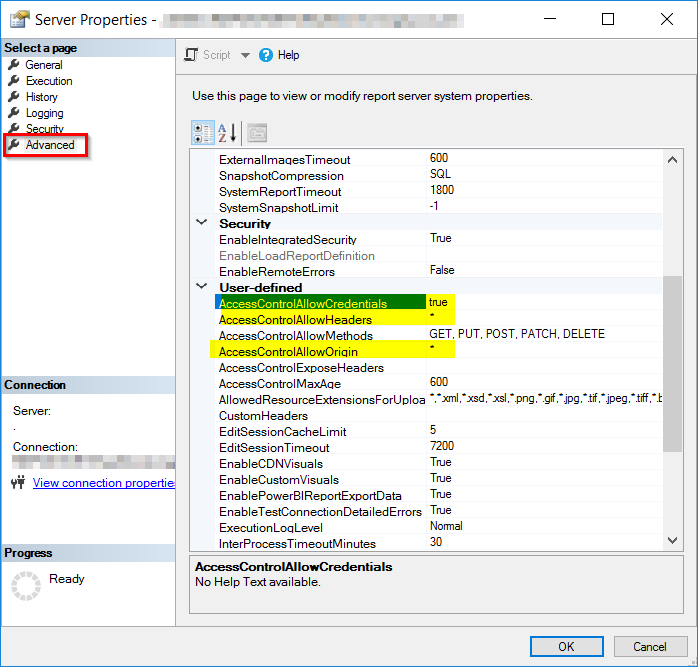

# How to Enable CORS in SSRS

If your web app is located on a different host than the Report Server, then you'd need to enable Cross-Origin-Resource-Sharing (CORS) on your Report Server.

1. Open SSMS (SQL Server Management Studio).
2. Connect to your Report Server (choose **Reporting Services** in the *Server Type*).

3. Right-click on the report server instance and select **Properties**.
4. Open the **Advanced** page and scroll down to the *User-Defined* section.
5. Set the following configurations:
   - *AccessControlAllowCredentials*: true
   - *AccessControlAllowHeaders*: *
   - *AccessControlAllowOrigin*: *
6. Click **OK**.

